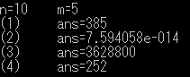

# 問1

任意の整数に対して動くプログラムを作成したが、ここでは`n=10, m=5`で計算した結果を載せている。
## main.c
```C
#include <stdio.h>
#include "sub.h"

int main(void)
{
    int n=10/*任意の整数を入力*/, m=5/*任意の整数を入力*/;

    if(n<1)
    {
        printf("Bad number n has been entered.\n");
    }
    else if (m<0 || m>n)
    {
        printf("Bad number m has been entered.\n");
    }
    else
    {
        printf("n=%d\tm=%d\n", n, m);
        printf("(1)\tans=%d\n", sigma(n));
        printf("(2)\tans=%le\n", product(n));
        printf("(3)\tans=%d\n", factrial(n));
        printf("(4)\tans=%d\n", convination(n, m));
    }
}
```

## sub.c
```C
#include <stdio.h>

/*(1)*/
int sigma(int n)
{
    int ans=0;
    for(int k=1; k<=n; k++)
    {
        ans += k*k;
    }
    return ans;
}

/*(2)*/
double product(int n)
{
    float ans=1.0;
    for(float k=1.0; k<=n; k++)
    {
        ans *= 1/(k*k);
    }
    return ans;
}

/*(3)*/
int factrial(int n)
{
    int ans=1;
    for(int k=1; k<=n; k++)
    {
        ans *= k;
    }
    return ans;
}

/*(4)*/
int convination(int n, int m)
{
    int ans, num=1, den=1;

    for(int k=0; k<m; k++)
    {
        num *= n-k;
    }

    for(int l=1; l<=m; l++)
    {
        den *= l;
    }

    ans = num/den;

    return ans;
}
```
## sub.h
```
#ifndef SUB_H
#define DUB_H

int sigma(int);
double product(int);
int factrial(int);
int convination(int ,int);

#endif
```
## makefile
```makefile
#makefile
.PHONY : cleen help

CC := gcc
CFLAGS := -o main.out
CPPFLAGS :=
LDFLAGS :=
LDFLIBS :=

main.out : src/main.c src/sub.c
	$(CC) $(CFLAGS) main.c sub.c
	@echo "exported as \""$@"\""

cleen :
		rm main.out
```
## 出力結果
[](./image/result.png)

----
- [問2へ]()
- [問3へ]()
- [問4へ]()
- [問5へ]()
- [問6へ]()
